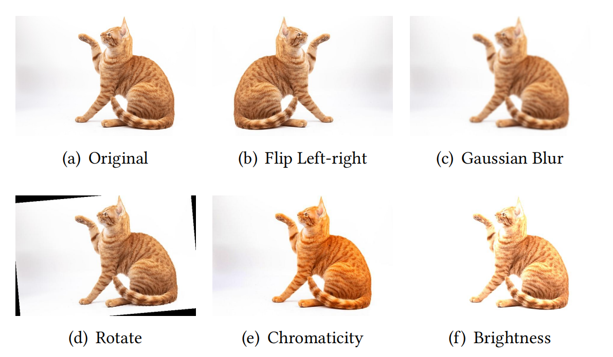

# CMPS: Cluster-Based Multi-Objective Metamorphic Test Case Pair Selection for Deep Neural Networks

This repository contains the replication package for the paper "*Cluster-Based Multi-Objective Metamorphic Test Case Pair Selection for Deep Neural Networks*". It provides experimental code, data, and related documentation to support the reproduction of the CMPS approach proposed in the paper and further research.

---

## Repository Structure

The directory is structured as follows:

```
.
├── experimental_data
│   ├── cifar10_resnet50
│   ├── cifar10_vgg19
│   ├── fashion_lenet1
│   ├── fashion_lenet5
│   ├── imagenet_googlenet
│   └── imagenet_resnet
├── requirements.txt
├── results
│   ├── CMPS
│   ├── CMPS-NC
│   ├── NSGA-II
│   └── RS
├── src
│   ├── CMPS-NC.py
│   ├── CMPS.py
│   ├── NSGA-II.py
│   ├── mr_5.py
│   ├── my_dbscan.py
│   └── random_selection.py
└── subjects
    ├── datasets
    └── models
```

### Experimental Subjects

First, we briefly introduce the datasets, DNN models, and metamorphic relations (MRs) used in our experiment.

#### Datasets & DNN Models

In our experiments, we selected three datasets and assigned two DNN models to each dataset, i.e., a total of six experimental subjects, as follows:

| Dataset       | Test Set | DNN Model |
|:-------------:|:--------:|:---------:|
| Fashion-MNIST | 10,000   | LeNet1    |
|               |          | LeNet5    |
| CIFAR-10      | 10,000   | VGG19     |
|               |          | ResNet50  |
| ImageNet      | 10,000   | GoogleNet |
|               |          | ResNet50  |

The `datasets` subfolder under the `subjects` directory contains these three datasets, while the `models` subfolder stores the pretrained models corresponding to these six experimental subjects.

#### Metamorphic Relations (MRs)

We selected five different MRs:

* **MR1 - Flip Left-right** : The DNN model’s outputs should remain consistent when the image is flipped from left to right.
* **MR2 - Gaussian Blur** : The DNN model’s outputs should remain consistent when the image undergoes Gaussian blurring.
* **MR3 - Rotate 5°** : The DNN model’s outputs should remain consistent when the image is rotated by 5&deg;.
* **MR4 - Change Chromaticity** : The DNN model’s outputs should remain consistent when the chromaticity of the image is increased.
* **MR5 - Adjust Brightness** : The DNN model’s outputs should remain consistent when the brightness of the image is increased.

Here's an example demonstrating how MRs transform the source test case into its follow-up test cases.



The implementations of these five MRs are in the `mr_5.p` file under the `src` folder. You can also add new MRs based on your own needs.

#### Experimental Data


For easy replication, each subfolder in the `experimental_data` directory contains data for the corresponding experimental subjects, including the model's predicted labels for the source test cases, output probabilities of source test cases, and predicted labels for the follow-up test cases. This way, you can directly read the corresponding `.mat` files of each subject for processing without the need to load the models. Taking the `cifar10_vgg19` folder as an example, the results of each MR are stored separately in their respective `.mat` files, totaling five files.

---

## Getting Started

Follow these steps to set up the environment and run the experiments.

### Requirements
Run the following command to set up the same environment as the experiment based on the provided `requirements.txt` file:

```
pip install -r requirements.txt
```

### RQ1 (Failure-Triggering Capability)

#### CMPS

Before running `CMPS.py`, you need to modify the paths in the code:

* `base_path`: The path where you store the datasets.
* `dir_path`: The path where you store the experimental data (i.e., the `experimental_data` directory).
* `output_path`: The path where you want to save the results of CMPS.

After modifying the paths, run the following command to obtain the CMPS selection results  and their TRC values for all experimental subjects：

```
python CMPS.py
```

We also store the original CMPS results from our experiment in the `CMPS` subfolder within the `results` directory. The storage format is a dictionary, where the key is the image name of the selected source test case, and the value is a list that includes the metamorphic relation, the source test case label, and the follow-up test case label.

#### NSGA-II

For NSGA-II, we directly used the [replication package](https://doi.org/10.5281/zenodo.6389008) provided by the original paper "*Multi-Objective Metamorphic Follow-up Test Case Selection for Deep Learning Systems*" and stored the raw results after execution in the `NSGA-II` subfolder under the `results` directory.
Before running `NSGA-II.py`, you need to modify the paths in the code:

* `res_path`: The path where you store the raw results of NSGA-II.
* `dir_path`: The path where you store the experimental data (i.e., the `experimental_data` directory).

Run the following command to obtain the TRCs of the NSGA-II's raw results :

```
python NSGA-II.py
```

#### Random Selection (RS)

Before running `random_selection.py`, you need to modify the paths in the code:

* `dir_path`: The path where you store the experimental data (i.e., the `experimental_data` directory).
* `output_path`: The path where you want to save the RS results.

After modifying the paths, run the following command to obtain the RS selection results  and their TRC values for all experimental subjects：

```
python random_selection.py
```

We also store the original RS results from our experiment in the `RS` subfolder within the `results` directory. The storage format consists of index pairs `(i, j)`, where `i` represents the MR index and `j` represents the source test case index.

### RQ2 (Failure-Triggering Capability)

#### CMPS

After running `CMPS.py`, you can also get the FDR values of CMPS for all experimental subjects.

#### NSGA-II

After running `NSGA-II.py`, you can also get the FDR values of NSGA-II for all experimental subjects.

#### Random Selection (RS)

After running `random_selection.py`, you can also get the FDR values of RS for all experimental subjects.

### RQ3 (Ablation Experiment)

#### CMPS

The TRC and FDR values can be obtained from RQ1 and RQ2.

#### CMPS-NC

Before running `CMPS-NC.py`, you need to modify the paths in the code:

* `base_path`: The path where you store the datasets.
* `dir_path`: The path where you store the experimental data (i.e., the `experimental_data` directory).
* `output_path`: The path where you want to save the results of CMPS-NC.

After modifying the paths, run the following command to obtain the CMPS-NC selection results  and their TRC and FDR values for all experimental subjects across all cases：

```
python CMPS-NC.py
```

We also store the original CMPS-NC results from our experiment in the `CMPS-NC` subfolder within the `results` directory. The storage format is a dictionary, where the key is the image name of the selected source test case, and the value is a list that includes the metamorphic relation, the source test case label, and the follow-up test case label.
